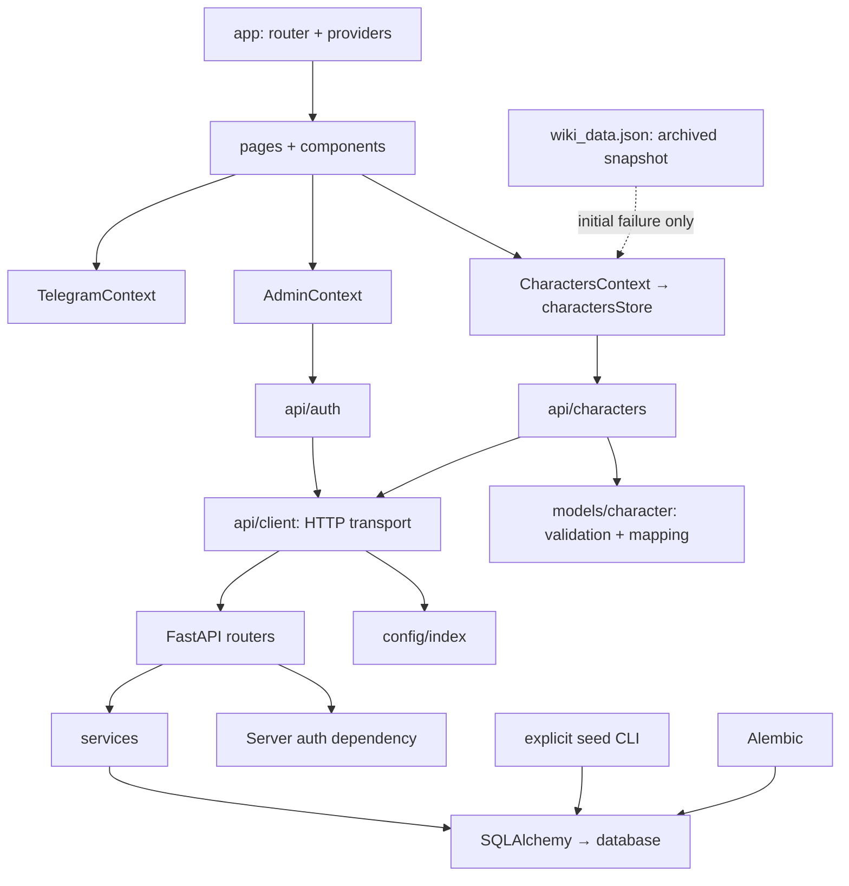

# Архитектура НПМ Фандом Вики

## Границы системы

Продукт — русскоязычная фан-вики и Telegram Mini App. React отвечает за представление, FastAPI — за опубликованные записи персонажей и права записи, SQLAlchemy — за доступ к постоянной БД. Редакционный контент арок и эпизодов версионируется вместе с исходниками.

## Где находится ответственность

| Изменение | Место |
|---|---|
| API base, timeout, development policy | `src/config/index.js`, `vite.config.js` |
| HTTP, abort, timeout, JSON, error envelope | `src/api/client.js`, `src/api/errors.js` |
| HTTP endpoints и request/response adapters | `src/api/characters.js`, `src/api/auth.js` |
| Canonical Character, runtime validation, serializer | `src/models/character.js` |
| Каталог и порядок async-операций | `src/data/charactersStore.js` |
| React subscriptions и public interface | `src/context/CharactersContext.jsx` |
| Серверная сессия администратора | `src/context/AdminContext.jsx` |
| Telegram lifecycle, safe area, back, haptics | `src/context/TelegramContext.jsx` |
| Маршруты и общий composition root | `src/app/`, `src/main.jsx` |
| Форма и CRUD interaction | `src/pages/AdminCharacterForm.jsx`, `src/pages/AdminPanel.jsx`, `src/components/admin/` |
| Theme tokens и явные Tailwind classes | `src/styles/tokens.js`, `src/utils/theme.js`, `tailwind.config.js` |
| Арки, эпизоды, медиассылки и будущие статьи | `src/data/wiki_data.json`, `src/data/editorial.js` |
| Серверный config/auth/DB/schemas | `backend/app/` |
| HTTP handlers / business transactions | `backend/app/routers.py`, `backend/app/services.py` |
| Изменение схемы / импорт начального лора | `backend/migrations/`, `backend/app/seed.py` |
| Regression tests | `tests/`, `backend/tests/` |

## Модель данных

Canonical Character использует отдельные `id` (database integer), `slug` (постоянная ссылка) и `version` (версия для конкурентных записей). API возвращает camelCase поля, как и раньше. Единственное существенное переименование вложенных данных: wire `relationships[].id` становится canonical `relationships[].slug`. UI не знает `dbId`, имён headers или API URL.

У archived characters `id=null`, `version=null`. Их нельзя сериализовать как цель update/delete. В static JSON сохранён оригинальный формат; один adapter переводит его в canonical при загрузке модуля.

Связи — редакционные ссылки по стабильному slug. После удаления цели сохраняется описание исторической связи; UI не строит несуществующую активную ссылку. Изменение slug обычным PUT запрещено. Никакое имя персонажа не является техническим ключом.

## Состояния каталога

Один snapshot `{status, characters, source, error, mutation}` публикуется через `useSyncExternalStore`.

| status | Что показывает UI | Запись |
|---|---|---|
| idle/loading | Loading state, без static flash | запрещена |
| success | Проверенные API записи | разрешена при server-verified admin |
| empty | API подтвердил пустой каталог | create разрешён |
| fallback | Архивная копия + явное предупреждение | запрещена |
| refreshing | Последний snapshot + индикатор обновления | запрещена |
| mutating | Последний snapshot + submitting action | другие записи запрещены |
| error | Ошибка; последний API snapshot остаётся видимым, если был | запрещена до успешного reload |

`loading`, `usingFallback`, `canMutate` вычисляются из snapshot. Их нельзя менять независимо. `source` объясняет происхождение данных; это не отдельная база.

Каждый read имеет AbortController и generation. Новый read отменяет и инвалидирует старый. Cleanup отменяет запрос; поздний ответ не меняет состояние. StrictMode повторно запускает тот же жизненный цикл безопасно.

Мутация допускается только в `success/empty`, синхронно переводит ресурс в `mutating`, использует серверную версию и не повторяется автоматически. POST/PUT response сразу добавляет/заменяет canonical запись; DELETE 204 сразу удаляет её из snapshot. Вторичного GET после успеха нет. Network/5xx outcome считается неподтверждённым: сначала явный reload, затем решение о повторе. Concurrent clients защищены backend version check.

## Политика fallback и хранения

Fallback разрешён только при network/timeout/5xx первоначального чтения, до первого успешного API response. Ошибки auth/validation/нарушения контракта не маскируются JSON. `[]` — корректный server response.

После API success fallback закрыт для текущей вкладки, включая refresh. `sessionStorage` содержит только отметку `api-confirmed`, привязанную к API base; там нет персонажей, draft или credentials. Если WebView запрещает storage, защита остаётся в памяти до refresh. Новая независимая вкладка без связи может показать явно помеченный архив: это не актуальная публикация.

Сохранённого кеша персонажей, автоматического merge JSON/API и автозасева при старте backend нет. Первичный seed — явная CLI-команда оператора для пустой базы. Пустая production database никогда не восстанавливается молча.

## Формы и навигация

Редактор получает один подтверждённый snapshot при входе, держит controlled draft и baseline. Reload не затирает draft. Новая server version отображается как конфликт с возможностью явного сброса. Submit имеет idle/submitting/success/error и синхронную защиту повторного запуска. Ошибки валидации связаны с доступными label/aria attributes.

Hash URL сохраняется; `createHashRouter` нужен для `useBlocker` и корректной защиты dirty forms. Переход внутри приложения требует решения в dialog; browser refresh/close использует beforeunload, Telegram close — доступный native confirmation. При сохранении нужно дождаться ответа. Прямой вход и unknown route имеют осмысленные экраны, Back при отсутствии app history ведёт в приложение.

## Авторизация

Frontend получает raw Telegram initData и передаёт его server auth. `initDataUnsafe.user` используется только для UI, никогда для решения о правах. HMAC, срок initData и ADMIN_IDS проверяет backend на каждом write. Auth session endpoint возвращает проверенный userId/isAdmin для видимости UI.

В обычном browser нет админских прав. В development доступен вручную вводимый `DEV_ADMIN_TOKEN`, который живёт только в памяти клиента. Сервер запрещает эту ветку в production. Все server secrets остаются в backend env. Подробный wire contract — [API.md](API.md).

## Ошибки и проверки

Transport разбирает empty/204, JSON и server error envelope. Модель отклоняет повреждённый 2xx response. Ошибки имеют тип, status/code, понятный текст и поля; пользователь не получает stack trace, SQL или секреты. Render error boundary обеспечивает recovery screen.

`npm run lint` проверяет JS/hooks и запрет HTTP/env/API paths в UI. `npm run test` проверяет реальные failure points. `npm run check:dist` сканирует production assets на loopback URL и bot token patterns. Backend pytest проверяет signed auth, CRUD, concurrency, migration, seed, health и CORS. CI запускает оба стека; ручные runtime результаты фиксируются отдельно в [OVERHAUL_REPORT.md](OVERHAUL_REPORT.md).
